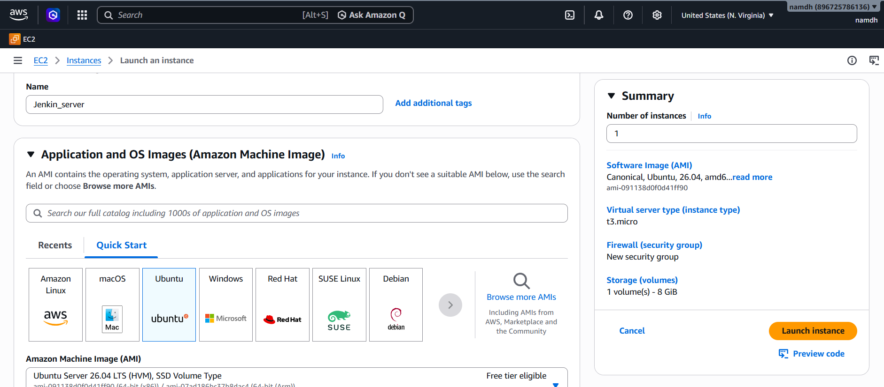

## First Setting Up Jenkins on an AWS EC2 Instance
This guide provide step-by-step instructions to launch an AWS EC2 Instance, install Jenkins, and access the Jenkins server. Follow these steps to set up a Jenkins server using Amazon Ubuntu on t2.micro instance

## Prerequisites
- An AWS account with appropriate permissions.
- Basic knowledge of SSH and terminal commands.
- A web browser to access the Jenkins dashboard.

## Step 1: Login in to AWS Account
1. Navigate to the [AWS MANAGE CONSOLE](https://aws.amazon.com/free/?trk=06dd4e64-3ddf-405e-bec9-d2414185926c&sc_channel=ps&ef_id=Cj0KCQjw2MbPBhCSARIsAP3jP9w7Vd4XlH7fZH8gZQ51yjxBNYHs9aJ9XJauygSeGaAW8BghZWT4m4waAsqTEALw_wcB:G:s&s_kwcid=AL!4422!3!798628412789!e!!g!!aws!23606217014!196761071947&gad_campaignid=23606217014).
2. Log in with your AWS credentials (username, password, and MFA if enabled).
3. In the AWS Console, locate the EC2 service under the "Compute" section or use the search bar to find "EC2."
4. Click EC2 to access the EC2 Dashboard.

## Step 2: Navigate to EC2 Dashboard
1. In EC2 dashboard, select `Instances` from the left-hand menu.
2. Click `Lauch Instance` to start creating a new EC2 instance.



## Step 3: Launch Instance
1. Configure infor of EC2 the following:
- ```Name```: Enter Jenkin_server
- ```Number of instance```: Set to ``1``
- ```Amazon Machine Image (AMI)```: Choose Ubuntu Pro - Ubuntu Server Pro 22.04 LTS  (HVM), SSH Volume Type (Free tier eligible).
- ```Architecture```: Seclect 64-bit (x86)

## Step 4: Confguire Instance
1. Instance Type: Select t3.micro (Free tier eligible, 2 vCPU, 1GiB memory).
2. Key Pair:
- If you have an exisiting key pair, select it from the dropdown.
- If not, click Create new key pair, name(e.g. jekins-key), choose RSA and .pem format, and download the key pair. Store it securely.
